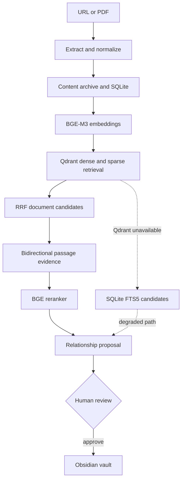

# PKP — Personal Knowledge Pipeline

PKP is a local-first knowledge pipeline that ingests articles and PDFs, uses hybrid retrieval and reranking to discover relationships across documents, and lets a human decide which proposed connections become durable in an Obsidian vault.

## Why I built this

I originally built PKP to experiment with the modern retrieval and RAG ecosystem: embeddings, dense and sparse search, vector databases, reranking, local models, hosted LLM providers, background execution, and human review. As those experiments accumulated, the project became a coherent system rather than a collection of isolated prototypes.

The practical problem was simple. Saved papers and articles accumulate, while the useful connections between them are easy to miss later. PKP became an exploration of how much of that discovery can be automated without silently degrading a human-maintained knowledge base.

## What it does

1. Ingest a URL or PDF.
2. Extract, normalize, chunk, and archive the source.
3. Index chunks for lexical retrieval and, when Qdrant is available, semantic retrieval.
4. Retrieve related documents and supporting passages.
5. Rerank the evidence and persist relationship proposals.
6. Let the user approve, reject, or skip each proposal.
7. Write approved relationship links into an Obsidian vault.

PKP can also generate research notes with a local Ollama model. Those notes follow a separate path from relationship review.

## Technical highlights

- **Dense and sparse BGE-M3 retrieval:** one local model produces semantic vectors and learned lexical weights for each chunk and query.
- **Hybrid search with RRF:** Qdrant retrieves from both representations and combines their ranked lists with Reciprocal Rank Fusion.
- **Lexical fallback:** SQLite FTS5 keeps search and candidate discovery usable when Qdrant is unavailable, with different capabilities and score semantics from hybrid retrieval.
- **Second-stage reranking:** a local BGE cross-encoder reranks search results and, separately, scores passage pairs for relationship proposals.
- **Bidirectional evidence:** proposal generation retrieves a candidate passage from the source query and a source passage from the candidate query.
- **Content filtering:** citation-heavy chunks remain archived and searchable through FTS5 but are excluded from the vector index.
- **Durable and derived storage:** source artifacts live in a content-addressed archive; Qdrant is a rebuildable index over archived chunks.
- **Local job execution:** a SQLite-backed queue and in-process polling worker handle ingestion, proposals, notes, and index rebuilds without external queue infrastructure.
- **Proposal memory:** unordered document pairs are deduplicated, and rejected pairs remain suppressed while their rejection record exists.
- **Optional structured explanations:** Ollama, OpenAI, or Anthropic can add a rationale and relationship type to an existing proposal.
- **Constrained vault mutation:** PKP inserts connections only inside managed markers and refuses malformed marker regions.
- **Human-gated connections:** automatic discovery stops at a proposal; only approval creates a durable relationship link.

## Architecture



[Architecture details](docs/architecture.md)

## Retrieval and relationship discovery

BGE-M3 generates both dense embeddings and sparse lexical weights. Qdrant searches the two representations and fuses the ranked results with RRF, producing document candidates from chunk hits. For each candidate relationship, PKP attempts to retrieve evidence in both directions: the source query selects a passage from the candidate, and a query derived from the candidate selects a passage from the source. The local BGE reranker then scores complete passage pairs before the surviving proposals are stored for review.

Existing and rejected document pairs are checked symmetrically, so reversing the pair does not bypass proposal history. An LLM is not required to retrieve candidates or create the initial proposal. If requested later, the configured LLM provider receives the stored evidence and updates the proposal with a structured rationale and relationship type.

## Human control and failure behavior

PKP automates source processing, retrieval, evidence gathering, and proposal generation. A relationship becomes a durable vault connection only after a human approves it. That boundary is specific to connections: PKP may create a note scaffold during ingestion, and an optional note-generation job may write the `## Notes` section without relationship approval.

Several optional paths degrade locally. URL extraction can fall back from the Crawl4AI Python extractor to Trafilatura. If Qdrant is unavailable at the outer search boundary, PKP uses SQLite FTS5; if reranking cannot produce scores, supported paths retain usable first-stage ordering. A failed optional LLM explanation leaves the existing proposal available for review. The Qdrant index is derived state and can be rebuilt from archived chunks.

These are targeted fallbacks, not a general retry system. In particular, ordinary failed worker jobs are recorded as failed without automatic backoff or a dead-letter queue.

[Design decisions and failure semantics](docs/design-decisions.md)

## Experiments that shaped the project

PKP has included experiments with FTS/BM25 and semantic retrieval, dense versus sparse representations, RRF, cross-encoder reranking, local and hosted LLMs, Crawl4AI and Trafilatura extraction, SQLite-backed jobs, long-document note synthesis, and marker-bounded vault writes. Its persistence layer also moved from an early Turso/libsql scaffold to local SQLite.

The experiments that remained all support one workflow: preserve sources, find plausible cross-document relationships, ground them in passages, and put the final knowledge-base mutation under human control.

[Experiments and evolution](docs/experiments.md)

## Quick start

PKP requires Python 3.12 or newer and uses `uv` for its locked environment.

```bash
git clone https://github.com/KiranRajeev-KV/pkp.git
cd pkp
uv sync --group dev
uv run pkp init
```

Start Qdrant for dense and sparse hybrid retrieval, ingest a URL, and run the local API and review UI:

```bash
docker compose up -d qdrant
uv run pkp ingest-url "https://example.com/article"
uv run pkp serve
```

The review queue is served at `http://127.0.0.1:8000/queue`. Local embedding and reranking models load lazily and may download model weights on first use.

[Setup and reproducibility](docs/reproducibility.md) · [CLI, configuration and API reference](docs/reference.md)

## Validation and evaluation

The tests cover important storage transitions, proposal deduplication and ordering, reranker fallback behavior, LLM response parsing, note-generation helpers, and vault mutation safety. They are mechanism tests, not retrieval-quality evaluation.

The repository does not currently include a labelled relevance dataset or benchmark for Recall@K, MRR, or nDCG, so PKP makes no measured retrieval-quality claim. A concrete offline comparison of FTS5, dense-only, sparse-only, hybrid RRF, and reranked hybrid retrieval is documented separately.

[Validation and evaluation](docs/evaluation.md)

## Known limitations

- There is no formal retrieval relevance benchmark yet.
- Local BGE-M3 embedding and BGE reranking are relatively heavyweight and add model-loading and inference costs.
- SQLite FTS5 fallback lacks the semantic capability and score semantics of hybrid retrieval.
- The SQLite queue and in-process worker are not a distributed job system; ordinary failures have no automatic retry, backoff, or dead-letter handling.
- Proposal approval and the following vault filesystem write are separate operations, so an approved proposal can exist without its connection being appended.
- URL extraction uses the Crawl4AI Python package, while health checks probe a separate Crawl4AI HTTP service that extraction does not use.
- Generated research notes currently depend on Ollama; OpenAI and Anthropic support proposal explanations only.

## Documentation

- [Architecture](docs/architecture.md)
- [Design decisions and failure semantics](docs/design-decisions.md)
- [Experiments and evolution](docs/experiments.md)
- [Validation and evaluation](docs/evaluation.md)
- [Reproducibility](docs/reproducibility.md)
- [CLI, configuration and API reference](docs/reference.md)
