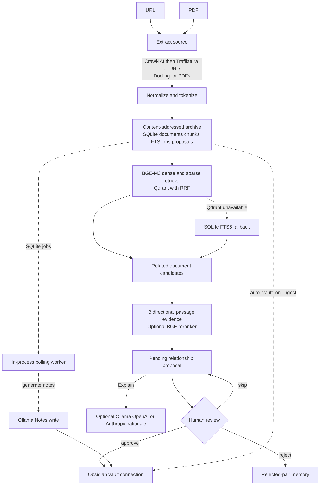

# PKP Architecture

PKP is a local-first document and knowledge pipeline. It captures sources durably, combines lexical and semantic retrieval to find related material, and turns promising relationships into reviewable proposals. Optional LLMs enrich explanations and notes; human review controls durable relationship links in the Obsidian vault.

## System at a glance

## Sources of truth and derived state

| Layer | Role | Authoritative? | Rebuildable? |
| --- | --- | --- | --- |
| Content-addressed archive | Stores original HTML/PDF, extracted and normalized Markdown, chunk JSONL, and metadata under a SHA-256 directory. Files use temporary siblings plus rename; arXiv enrichment may rewrite metadata. | Yes, for captured sources and processing artifacts. | Its chunks rebuild Qdrant. |
| SQLite | Stores documents, chunk provenance and FTS content, jobs, proposals, rejected pairs, ingestion metrics, indexing timestamps, and vault paths. | Yes, for PKP workflow state. | Not as a complete database. |
| Qdrant | Stores dense and sparse vectors plus chunk payloads in versioned, type-specific collections. | No; it is derived retrieval state. | Yes, from SQLite records and archived chunks. |
| Obsidian vault | Holds editable notes and curated connections. PKP manages constrained regions only. | Yes, as the human-facing artifact. | No, because it can contain human edits. |

## Ingestion

URL ingestion starts with the Crawl4AI Python library. When its output is below the configured word threshold, PKP compares Trafilatura output from the same HTML; if that is still insufficient, Trafilatura fetches the URL itself. A missing Crawl4AI package, unsuccessful result, or handled extraction error also takes the direct Trafilatura path. PDF ingestion uses Docling and can detect arXiv IDs in the title, filename, or opening text for best-effort metadata enrichment.

Both paths normalize Markdown, add frontmatter, and make overlapping chunks with the embedding tokenizer. PKP writes archive artifacts, inserts document and chunk state into SQLite and FTS5, optionally creates a vault scaffold, records ingestion timing, and then attempts vector indexing. Citation-heavy chunks remain available in the archive and FTS5 but are excluded from Qdrant.

CLI ingestion runs in the foreground by default and enqueues note and proposal jobs after a new document is created. CLI `--async` and API ingestion routes enqueue ingestion first; the polling worker performs the pipeline and queues follow-up work. Duplicate content returns the existing document instead of repeating normal ingestion.

## Retrieval

### First stage

Lazy BGE-M3 encoding produces a dense embedding and learned sparse lexical weights for each query. Qdrant prefetches each representation and fuses their ranked lists with RRF. PKP aggregates chunk hits into document results, retaining the best-ranked hit and match count. Stable UUIDv5 point IDs make Qdrant upserts deterministic; aliases can point to versioned physical collections.

### FTS5 fallback

When Qdrant is unavailable or hybrid search raises outside its collection loop, PKP searches SQLite FTS5. FTS5 uses the Porter `unicode61` tokenizer and title-weighted BM25. It is a lexical fallback, not an equivalent replacement for BGE-M3 sparse retrieval or RRF. A failed type-specific Qdrant collection can yield partial hybrid results without switching to FTS5.

### Second stage

Search reranking and proposal reranking use the same optional BGE cross-encoder for different inputs. Search scores `(query, best passage)`. Proposal generation disables that search step, retrieves evidence from both documents, then scores `(source passage, candidate passage)`. If scoring is disabled or fails, PKP keeps usable first-stage ordering.

## Relationship proposals

For a newly ingested document, PKP builds a query from its title and opening normalized body, retrieves a broad candidate set, and removes self matches, low-score candidates, existing pairs, and rejected pairs. Pair checks are symmetric, so reversing document order does not bypass history.

With Qdrant available, PKP retrieves a candidate passage using the source query and a source passage using a query built from the candidate. It stores those passages as proposal evidence. Complete passage pairs may be reranked and filtered by the proposal reranker threshold; candidates without complete evidence remain eligible in first-stage order. New proposals begin as pending with a template rationale and `related` type.

An LLM does not create candidates. The review action can send stored evidence to Ollama, OpenAI, or Anthropic and update a proposal with validated structured rationale and relationship type.

## Background execution

FastAPI starts one in-process polling worker. It atomically claims the oldest pending SQLite job and handles `ingest_url`, `ingest_pdf`, `generate_notes`, `generate_proposals`, and `rebuild_index`. Normal completion marks a job done; an exception marks it failed with error text. Startup resets stale running jobs, and cancellation returns the active job to pending.

The queue deliberately stays local and simple. It has no distributed workers, automatic backoff, retry policy, or dead-letter queue. A note-generation handler can return no notes while its job still reaches done because handler return values are not interpreted as job failure.

## Human control and vault writes

Discovery, evidence gathering, reranking, and pending proposals are automatic. A relationship connection is appended to the source note only after approval. Rejecting records the pair in the same SQLite transaction; skip leaves the proposal pending.

Connections are written only between `<!-- pkp:connections:start -->` and `<!-- pkp:connections:end -->`, with identical lines skipped. Generated note scaffolds and `## Notes` content are separate automated writes and do not use the relationship-approval gate. The vault writer refuses missing or malformed markers instead of rewriting an ambiguous region.

Approval and the filesystem append are separate operations: SQLite can record approval before a vault write fails. The UI and API return a warning in that case, and the connection can be absent even though the proposal is approved.

## External components

| Component | Role |
| --- | --- |
| Qdrant | Derived dense+sparse retrieval index; FTS5 handles the main degraded search path. |
| BGE-M3 | Embedding model and tokenizer for chunking and hybrid retrieval. |
| BGE reranker | Optional local second-stage scorer. |
| Crawl4AI and Trafilatura | Primary and fallback URL extraction. |
| Docling | PDF-to-Markdown extraction. |
| Ollama | Local proposal explanations and generated notes. |
| OpenAI and Anthropic | Optional hosted proposal explanations. |
| arXiv API | Best-effort metadata enrichment for detected papers. |

CLI and API health checks probe a Crawl4AI HTTP service at `localhost:11235`, while URL extraction uses the Python package directly. The health check therefore does not represent the extraction path.

## Scope

PKP is a local, single-user knowledge pipeline. It uses retrieval and background jobs to support document discovery and curated connections, rather than a distributed or multi-agent execution architecture.
