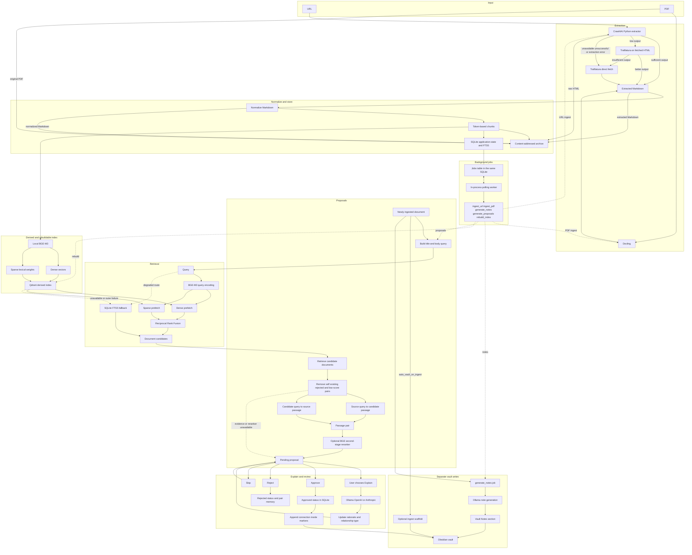

# PKP Architecture

PKP is a local-first document and knowledge pipeline for durable source capture, lexical and semantic retrieval, and cross-document relationship proposals. Optional LLMs enrich proposals and notes, but relationship links become durable only through human review. Obsidian is the human-facing knowledge layer; SQLite holds PKP's operational state.

## System at a glance

## Sources of truth and derived state

| Layer | Role | Authoritative? | Rebuildable? |
| --- | --- | --- | --- |
| Content-addressed archive | Stores original HTML/PDF, extracted and normalized Markdown, chunk JSONL, and `meta.json` under a SHA-256 directory. Artifacts use temporary siblings plus rename; arXiv enrichment may rewrite metadata later. | Yes, for captured source and processing artifacts. The whole archive is not immutable. | No as a whole; its chunks rebuild Qdrant. |
| SQLite | One database stores documents, chunk provenance and FTS content, jobs, proposals, rejected pairs, ingestion metrics, indexing timestamps, and vault paths. | Yes, for operational metadata and workflow state. | No supported full rebuild preserves every table. |
| Qdrant | Holds dense and sparse vectors with chunk payloads in per-type collections and optional aliases. | No; it is derived. | Yes, from SQLite documents and archived chunks. |
| Obsidian vault | Holds editable Markdown; PKP confines connections to markers and generated notes to `## Notes`. | Yes, as the human-facing artifact, not for job or proposal state. | No as a whole because it may contain human edits. |

## Ingestion path

URL ingestion first invokes the Crawl4AI Python library with a local browser. Output above the configured word threshold becomes the extracted Markdown. For shorter output, Trafilatura processes the same HTML and wins only if its text is longer; otherwise Trafilatura fetches the URL again. A missing Crawl4AI package, unsuccessful result, or `ExtractionError` also reaches direct fetch. Other exception types propagate.

PDF ingestion uses Docling and rejects missing, unparseable, empty, or insufficient output. It detects arXiv IDs in the title, filename, or opening lines. Best-effort enrichment updates the SQLite title and atomically rewrites archive metadata before chunks enter FTS.

Both paths normalize Markdown, add frontmatter, and make overlapping chunks with the embedding model's tokenizer. PKP writes archive artifacts, inserts the document and chunks into SQLite/FTS5, optionally creates a vault scaffold, records timing, then attempts vector indexing. Citation-heavy chunks stay in archive and FTS but are omitted from Qdrant. Missing Qdrant or failure after one retry leaves a successful, unindexed ingest; repeated ingest can repair indexing, and full rebuild reads archived chunks.

Default CLI ingestion runs in the foreground, then enqueues `generate_notes` and `generate_proposals` for a new document. CLI `--async` and API endpoints enqueue ingestion first; the worker then adds those downstream jobs. Duplicate content returns `created=false`, so it adds none.

## Retrieval architecture

### First-stage retrieval

Lazy `BGEM3FlagModel` encoding produces dense embeddings and learned sparse lexical weights. Qdrant prefetches both named fields and fuses their lists with Reciprocal Rank Fusion. Chunk hits become document results: the first supplies score and metadata, later hits increment `match_count`, and results across type-specific collections are ordered by best rank.

Physical names such as `article_v1` may use an `article_current` alias. Chunk IDs map through UUIDv5 to stable point IDs; physical collections work when alias APIs do not.

### FTS fallback

When Qdrant is unavailable or outer hybrid search raises, SQLite FTS5 receives sanitized quoted OR terms. Its Porter `unicode61` tokenizer and `bm25(chunks_fts, 10.0, 1.0)` weight title above content before document aggregation. FTS ranks differ from BGE sparse weights and RRF scores. Per-collection Qdrant errors are swallowed, so partial or empty results may not activate FTS.

### Second-stage reranking

Normal search scores each first-stage document's best passage as `(query, passage)` with lazy `BAAI/bge-reranker-v2-m3`. Proposal search disables that step, retrieves evidence both ways, then scores `(source passage, candidate passage)`. Disabled or failed scoring preserves first-stage order; documents without evidence follow the reranked subset.

## Proposal architecture

PKP queries with the title and first 500 body characters after recognized frontmatter. Hybrid search without search reranking, or FTS fallback, retrieves more than `proposal_top_n`. Filtering removes self matches, scores below `proposal_min_score`, existing proposals, and rejected pairs. Pair lookups are symmetric.

With Qdrant, the source query selects a candidate passage and the candidate query selects a source passage. Stored `passage_a` and `passage_b` pairs may be reranked and filtered by `reranker_min_score`; candidates lacking a pair remain eligible. New proposals are pending with a template rationale, default `related` type, and final retrieval or reranker score. The LLM does not produce candidates.

On request, Ollama, OpenAI Responses, or Anthropic Messages may replace the template with validated JSON rationale and relationship type. Failure leaves the row unchanged.

## Background execution

FastAPI starts one polling worker. An atomic SQLite `UPDATE ... RETURNING` claims the oldest pending job. Handlers are `ingest_url`, `ingest_pdf`, `generate_notes`, `generate_proposals`, and `rebuild_index`; CLI rebuild runs directly, and no API route enqueues it.

Handlers end as `done`; raised exceptions produce `failed` with error text. Cancellation shields a reset to `pending`, and startup resets leftover `running` rows. There is no backoff, dead-letter handling, or exactly-once guarantee.

## Failure and degradation paths

| Failure | Current behavior |
| --- | --- |
| Crawl4AI missing, unsuccessful, short, or raises `ExtractionError` | PKP may try Trafilatura on the same HTML, then a direct Trafilatura fetch. Unexpected exception types propagate. |
| Qdrant unavailable | Ingestion skips vector indexing; search and proposal candidates use FTS5; passage evidence is absent; rebuild raises. |
| Qdrant indexing failure | Setup failure is contained; upsert/embed gets one retry, then ingest completes without `indexed_at`. |
| Reranker failure | Search keeps Qdrant ordering; proposals keep eligible first-stage candidates. |
| Passage evidence lookup failure | Each direction is caught independently and stored as `None`; the candidate can remain but is not pair-reranked without both passages. |
| Optional explanation failure | The row stays unchanged. The UI error mentions Ollama even for another configured provider. |
| Note-generation failure | A retry placeholder is written when possible. Returning `False` still lets the worker mark the job `done`. |
| Worker cancellation | The active job is returned to `pending`; startup also resets stale `running` jobs. |
| Ordinary worker exception | The job becomes `failed` with the exception text. There is no automatic retry. |
| Missing or corrupt vault markers | The writer raises without rewriting the managed region; approval may already be persisted. |
| arXiv lookup or parsing failure | PKP logs it, keeps existing title and metadata, and continues PDF ingestion. |

## Human-control boundary

### Requires human approval

Discovery, evidence lookup, reranking, and template rationales are automatic; explanation is on demand. Only approval appends a connection to the source document's note. The atomic write stays between `<!-- pkp:connections:start -->` and `<!-- pkp:connections:end -->` and skips an identical line.

Rejection atomically changes status and records the pair in either ordering. Skip only advances the UI; status remains pending.

### Does not require relationship approval

`auto_vault_on_ingest` may create a scaffold. `generate_notes` may create one and replace `## Notes` with Ollama output or a failure placeholder. Neither inserts a relationship.

## Transaction boundaries

Approval and vault mutation are separate. SQLite commits `approved` before the filesystem append; failure leaves an approved proposal without a connection and returns a warning. Rejection status and pair memory share one SQLite transaction.

Ingestion also spans stores. Archive files are individually atomic, SQLite methods commit rows, and Qdrant follows; no transaction covers the stores or full archive bundle. Mid-pipeline failure can leave partial state, with a targeted repair only for unindexed documents.

## External and optional components

| Component | Role and degradation behavior |
| --- | --- |
| Qdrant | Derived dense+sparse index. Handled search failures use FTS; rebuild requires it. |
| BGE-M3 | Provides normalization tokenizer and lazy embeddings. FTS needs no vector inference, but ingestion needs the tokenizer. |
| BGE reranker | Optional lazy second-stage scorer. Failure retains first-stage results. |
| Crawl4AI Python package | Browser extraction; if missing, Trafilatura fetches directly. |
| Trafilatura | Processes fetched HTML and supplies direct-fetch fallback. |
| Docling | PDF-to-Markdown extraction with no alternate parser. |
| Ollama | Default explanation provider and only notes provider; enrichment failure preserves captured sources. |
| OpenAI and Anthropic | Optional explanation providers requiring API keys. |
| arXiv API | Best-effort PDF metadata enrichment; failure does not abort ingestion. |

Extraction uses the Crawl4AI library, yet CLI and API health checks probe an HTTP service at `localhost:11235`. The health check does not match extraction.

## Architecture boundaries

Current source implements a single local application and an in-process worker. PKP is not multi-agent, GraphRAG, a knowledge graph, a distributed worker platform, a retrieval evaluation framework, or a hosted multi-user system. Its retrieval path supports document discovery and curated connections rather than a conversational question-answering surface.
